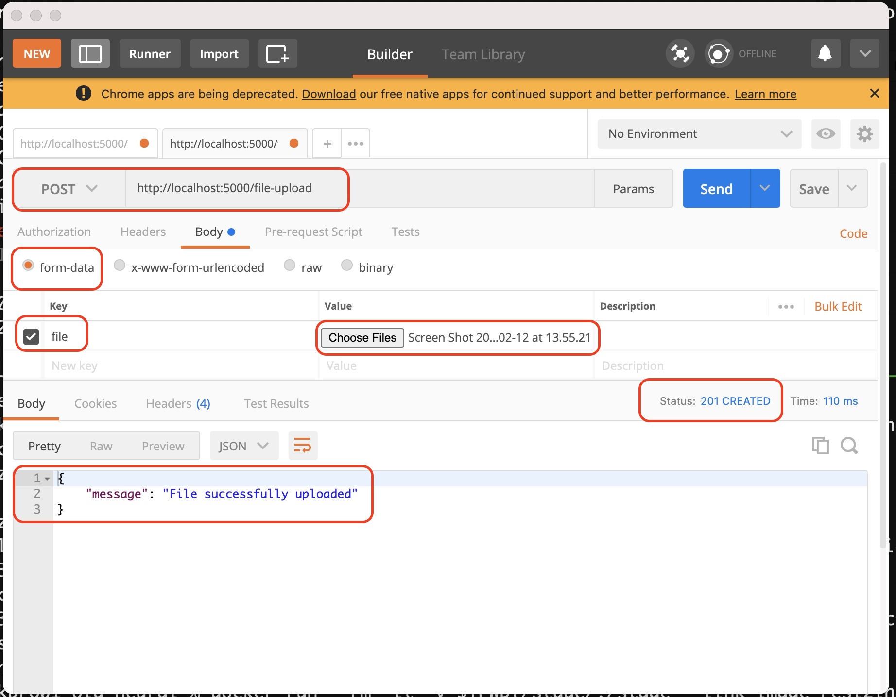
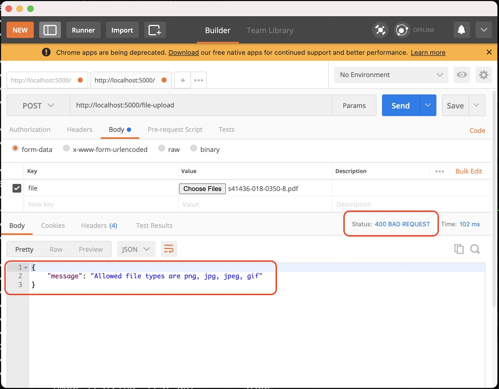

# The challenge 
The proposed challenge will be simple, but because we are a startup, in addition to technical skills, 
communication and research for solutions is very important. Keep this in mind when solving it.

Implement a REST API that receives an image and sends the image through a queue to a second application 
that resizes it to the size of 384x384.

Use the programming practices you deem necessary, taking into account that the use of requirements and 
differentials listed in the vacancy will be considered a bonus.

Development should be done in Python. The project must be delivered with Docker.

## Extras:

- If the size is configurable how would you change your architecture?
- How complex is your solution?
- Is it possible to improve the performance of the solution? How do the improvements impact the reading 
and maintenance of the code?
- How can the system scale with the planned architecture?

# The solution 

## Installation

### REST API
Build a image that will be used as REST API using Dockerfile inside folder ./rest_api
```console
docker build -t rest_api:0.1 ./rest_api/
```

### Image Resizing
Build a image that will be used for image resizing using Dockerfile inside folder ./image_resizing
```console
docker build -t image_resizing:0.1 ./image_resizing/
```

## Running aplication

### Launching rest API container
The application needs one (and only one) rest api container running in order to receive requests.
This container will be named as **image_resizing_rest_api**, so other containers in the network can
find it and connect to it. 
```console
docker run --rm -it -v ${PWD}/stage/:/stage --name image_resizing_rest_api -p 5000:5000 -p 5672:5672 -p 15672:15672 rest_api:0.1
```

### Launching image resizing container(s)
You can launch as many image resizing containers as you want (consumers in RabbitMQ terms) by launching 
multiple containers using the following command
```console
docker run --rm -it -v ${PWD}/stage/:/stage --link image_resizing_rest_api image_resizing:0.1
```

### Testing the application

Once you have the API container and at least one image resizing container up and running, you may test the application
by POSTing a image on the **/file-upload** endpoint at **localhost** (if you application was deployed locally). 
For this test, we will be using [PostMan](https://www.postman.com/ "Postman website").

Make sure PostMan is installed on your machine. Open it and configure it to:

 1. Select **POST** method and use the endpoint **http://localhost:5000/file-upload** (if deployed locally),
 1. Select **form-data**, 
 1. Select the gray arrow on the right of the field and mark **file** checkbox,
 1. **Choose files** to be uploaded
 1. Hit **Send** 

If everything goes as expected, you should see a success message similar to the one bellow



All images will be saved on the **stage** folder. Resized images will be saved on its subfolder **/stage/resized**

If something goes wrong during submission (eg. an invalid file format was submitted), you should see a exit code 400 and
a message highlighting the cause of error:



